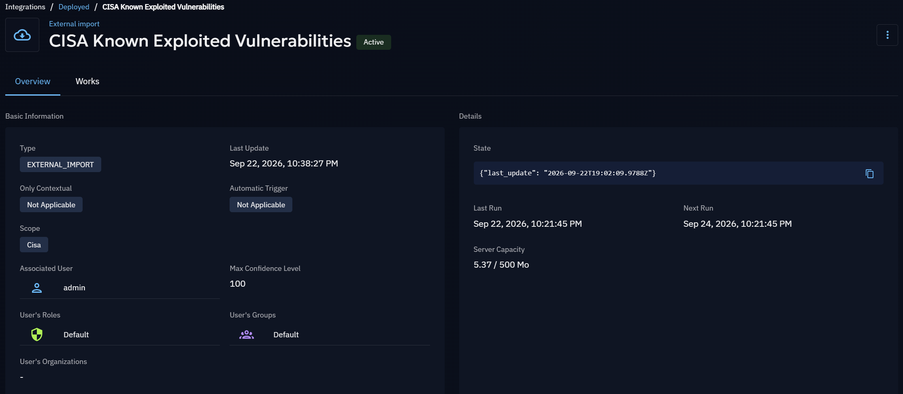
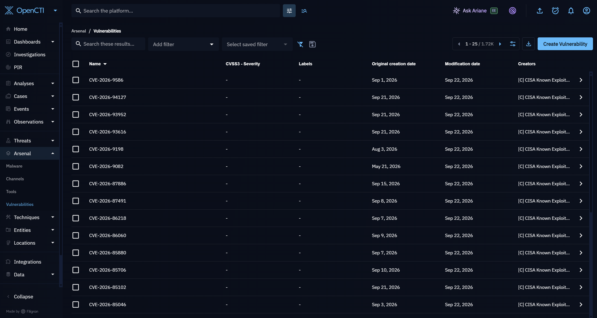
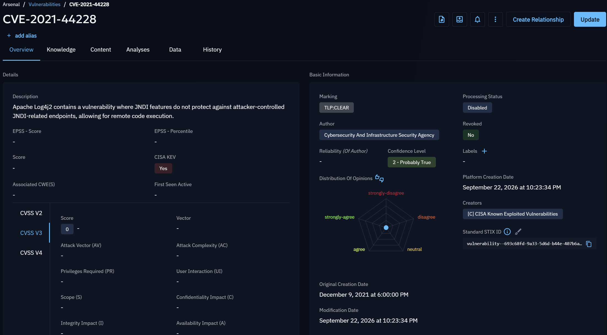

# CISA Known Exploited Vulnerabilities Integration

## Overview

I integrated the CISA Known Exploited Vulnerabilities (KEV) catalog into my OpenCTI environment to bring information about vulnerabilities known to be actively exploited in the wild into the lab.

This gives me a source of vulnerability intelligence that I can use for vulnerability research, threat analysis, and future threat hunting.

## Why CISA KEV?

The CISA KEV catalog tracks vulnerabilities that have evidence of active exploitation.

I wanted to include this data in the lab so I can distinguish between vulnerabilities that simply exist and vulnerabilities that are known to be actively exploited. This will also be useful later when determining which vulnerabilities may be more relevant to the organizations and sectors I am monitoring.

## Implementation

The CISA KEV OpenCTI connector was deployed as a Docker container alongside the existing OpenCTI services.

The connector communicates with the local OpenCTI instance and imports entries from the CISA KEV catalog as vulnerability objects.

The connector ID is stored as an environment variable and is not included in this repository.

## Verification

After deploying the connector, I verified that:

- The CISA KEV connector appeared as active in OpenCTI.
- The connector successfully completed an import.
- Approximately 1,720 vulnerability objects were available in OpenCTI after ingestion.
- Imported vulnerabilities identified CISA Known Exploited Vulnerabilities as their creator.
- Individual vulnerabilities could be opened and investigated within OpenCTI.

As an additional check, I located CVE-2021-44228 (Log4Shell) and confirmed that OpenCTI identified it as a CISA KEV vulnerability.

## Evidence

### CISA KEV Connector

The CISA KEV connector registered successfully with OpenCTI and completed its scheduled import.

### Vulnerability Ingestion

After the initial import, approximately 1,720 CISA KEV vulnerability objects were available in OpenCTI.

### Vulnerability Verification

I verified the ingestion by locating CVE-2021-44228 and confirming that OpenCTI identified it as a CISA Known Exploited Vulnerability.

## Troubleshooting

During the initial deployment, the connector repeatedly stopped with the following error:

`KeyError: 'name'`

The error occurred while automatic OpenCTI service account creation was enabled for the connector.

I removed the automatic service account creation settings from the CISA KEV connector configuration and recreated the container. After the change, the connector remained running, registered successfully with OpenCTI, and completed the KEV import.

This was a useful reminder to verify connector logs and container status instead of assuming that a successfully created Docker container means the integration is working.

## Next Steps

- Enrich imported vulnerabilities with additional vulnerability intelligence.
- Investigate KEVs relevant to healthcare organizations.
- Identify vulnerabilities that may be relevant to nonprofit organizations.
- Correlate vulnerability intelligence with other threat intelligence sources.
- Use vulnerability intelligence as part of future threat hunting and reporting workflows.
`
